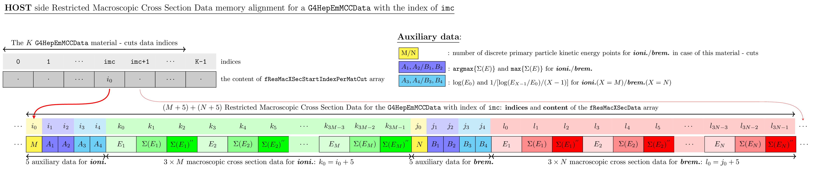
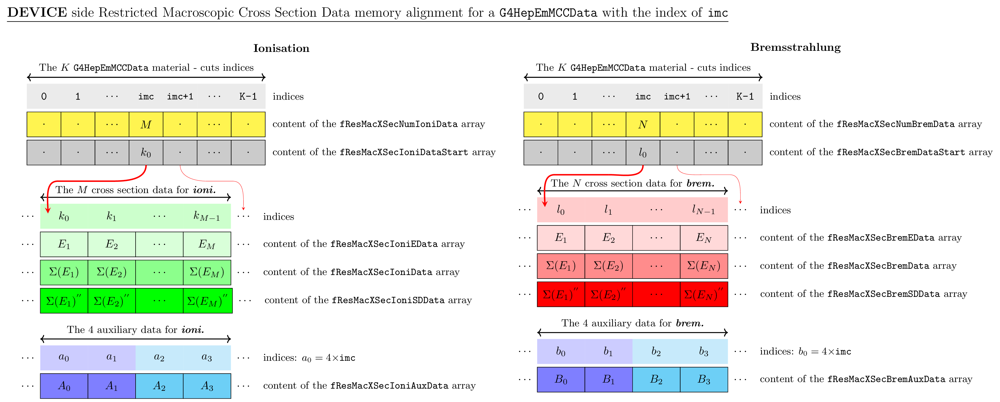
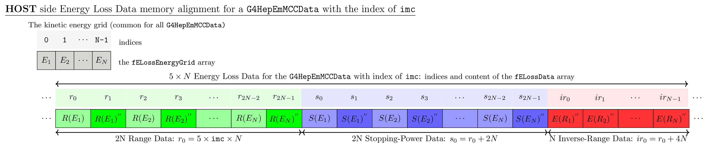

The ``G4HepEmData`` library documentation
---------------------------------------------

Documentation of the **global** data structures defined in the ``G4HepEmData`` library.
These data structures are **filled at initialisation time** by using the functionalities
provided by the ``G4HepEmInit`` library and **used (read-only) at run-time** with the corresponding
functionalities arranged into the ``G4HepEmRun`` library.

.. _ref-Global-data-structures:

Global data structures
.......................

**Global data** structures are those **used and shared by all particles and all workers**. These includes

 - :cpp:class:`G4HepEmParameters` : a collection of configuration parameters
 - :cpp:class:`G4HepEmMatCutData` : a collection of material - (secondary production cuts) couple related data for all material - cuts couples used in the geometry
 - :cpp:class:`G4HepEmMaterialData` : a collection of material related data for all materials used in the geometry
 - :cpp:class:`G4HepEmElementData` : a collection of element related data for all elements used in the geometry

These data structures are **built by the master** :cpp:class:`G4HepEmRunManager` in its :cpp:func:`G4HepEmRunManager::InitializeGlobal()` method that
is invoked at the first call to its :cpp:func:`G4HepEmRunManager::Initialize()` method. These objects are **owned by
the master** :cpp:class:`G4HepEmRunManager` **that stores** a pointer to the **them**

  - a pointer member to the :cpp:class:`G4HepEmParameters`
  - the pointers to the :cpp:class:`G4HepEmMatCutData`, :cpp:class:`G4HepEmMaterialData`, :cpp:class:`G4HepEmElementData` objects are stored in the top level data structure,
    :cpp:class:`G4HepEmData` member

The master **shares these** two data members **with all the worker** :cpp:class:`G4HepEmRunManagers` by setting their own members pointing to the data stored in the master.

**Further data** structures, that are **still global over the worker** :cpp:class:`G4HepEmRunManager` -s **but specific for a given particle type**, are also **built and owned by the master** :cpp:class:`G4HepEmRunManager`,
when its :cpp:func:`G4HepEmRunManager::Initialize()` method is called with the given particle type as input argument.
Pointers to these data structures are **also stored in the** :cpp:class:`G4HepEmData` **collection of the master and shared with the workers**.

These are the :cpp:class:`G4HepEmElectronData` structures for :math:`e^-/e^+`, that stores all integrated quantities (e.g. restricted dE/dx, range, inverse range, macroscopic cross section,
target element selector data) for the two energy loss (i.e. continuous-discrete) interactions, *ionisation* and *bremsstrahlung*.
Additional data structures, used by a give interaction description such as the :cpp:class:`G4HepEmSBTableData` and shared by all workers, might also be stored in this top level
:cpp:class:`G4HepEmData` structure.

**These global data structures** are **constructed and populated at the initialization**
phase and **used (read-only) during the run** of the simulation.

.. note:: There is an additional data structure, the :cpp:class:`G4HepEmTLData` that is used only during the run of the simulation.
   Each worker has their own, individual object from this data and it's used to store all worker-local
   data such as the pointer to the worker-local random number generator or the worker-local
   primary and secondary track buffers. This :cpp:class:`G4HepEmTLData` is **not global** and **used only at run-time** so
   it's defined in the ``G4HepEmRun`` library.

.. _ref-Host-vs-Device-memory:

Host v.s. Device side memory layouts
...........................................

.. warning::

      At the moment, **the same memory layout is used on the hots and device sides** in order to (drastically > 95 %)
      increase the run-time ``G4HepEm`` codes that are reusable on the device side without any changes!

      Investigation of possible performance gains, due to optimised device data memory, have been postponed for alter time when the GPU related simulations will be available.

These global data structures, especially the integrated cross section related quantities such as the restricted energy loss or macroscopic
cross section related data stored in the :cpp:class:`G4HepEmElectronData` structure, are used heavily in each simulation steps
(some even more than once). By choosing the memory layout of these data, such that it resonate maximally to the run-time access pattern,
ensures maximal performance benefits form data locality.

While the primary target platforms of the ``G4HepEm`` R&D project are those based on CPU (*host*), the project also supports GPU (*device*)
based simulations. Since the optimal memory layout of the data is determined by the access pattern, and this is different on the *host* and *device*
sides, the same data are stored in different formats on the *host* and *device* memory.

**Host** side memory layout of global data
^^^^^^^^^^^^^^^^^^^^^^^^^^^^^^^^^^^^^^^^^^^^

A *single track* is propagated during the *host* side simulation and the above data are interpolated for the given primary particle energy.
It means, that all the data, needed for a single kinetic energy interpolation, are accessed *"at once"*.
Therefore, all these different type of data, for a single kinetic energy value, need to be as close to the CPU as possible i.e. in the L1 data cache. This can be
facilitated by storing these different type of data, related to a single kinetic energy, next to or as close as possible to each other in the memory. This memory layout, together
with the appropriate interpolation functions (implemented in the ``G4HepEmRun`` library) that exploit this memory pattern, ensures optimal data cache usage during the *host* side
simulation leading to maximal (related) performance benefits.

As an example, the *host* side memory layout of the restricted macroscopic cross section related data (stored in the :cpp:class:`G4HepEmElectronData` data structure for *ionisation* and *bremsstrahlung* for all material cuts - couples)
is shown in :numref:`Fig. %s <mxsec_host>`. Since the macroscopic cross sections for *ionisation* and *bremsstrahlung* for a given material - cuts are accessed, i.e. interpolated for the given particle energy :math:`E` after each other during the step limit computation,
these data are stored one after the other for a given material - cuts couple. During the related part of the step limit, the first two auxiliary data is accessed in order to account the energy loss during the step, then the remaining two auxiliary
data are used to compute the kinetic energy bin index :math:`i` such that :math:`E_i \leq E < E_{i+1}`. Then the spline interpolation of these macroscopic cross sections is performed for the given primary energy of :math:`E` that
requires 6 data in case case: :math:`E_i, \Sigma(E_i), \Sigma(E_i)^{''},E_{i+1}, \Sigma(E_{i+1}), \Sigma(E_{i+1})^{''}`.
As it can be seen in :numref:`Fig. %s <mxsec_host>`, similarly to the four auxiliary data, all these 6 data are located next to each other in the *host* side memory.

   Memory alignment of the **restricted macroscopic cross section data** stored in the :cpp:class:`G4HepEmElectronData` structure for all :cpp:class:`G4HepEmMCCData`, material-cuts couple data.

**Device** side memory layout of global data
^^^^^^^^^^^^^^^^^^^^^^^^^^^^^^^^^^^^^^^^^^^^^^

When *multiple tracks* (arranged according to some common properties e.g. particle type and/or current volume i.e. material - cuts couple etc.) are propagated simultaneously, the above data
are interpolated to the different primary particle kinetic energies of the tracks. It means, that the different type of data, needed during the step limitation (spline interpolation), are accessed
one after the other by all tracks simultaneously. Therefore, the same type of the data, for all the discrete kinetic energies, should be located next to or as close as possible to each other in order
to facilitate coalesced memory access.

As an example, the memory layout of the *device* side version of the *host* side restricted macroscopic cross section related data shown in :numref:`Fig %s<mxsec_host>`, is shown in
:numref:`Fig %s<mxsec_device>`. As it can be seen, the macroscopic cross section related data, stored continuously in a single array on the *host* side, is split into 6 different arrays according to the type of the data
in order to facilitate coalesced memory access.

   **Device** side memory alignment of the **restricted macroscopic cross section data** stored in the :cpp:class:`G4HepEmElectronDataOnDevice` structure for all :cpp:class:`G4HepEmMCCData`, material-cuts couple data.

An additional example, the energy loss related data, is shown in :numref:`Fig %s<eloss_host>` and :numref:`Fig %s<eloss_device>`.

   Memory alignment of the **energy loss data** stored in the :cpp:class:`G4HepEmElectronData` structure for all :cpp:class:`G4HepEmMCCData`, material-cuts couple data.

.. figure:: figs/elossData/fig_elossData_onDEVICE.png
   :name: eloss_device
   :scale: 20 %
   :alt: elossData_device

   **Device** side memory alignment of the **energy loss data** stored in the :cpp:class:`G4HepEmElectronDataOnDevice` structure for all :cpp:class:`G4HepEmMCCData`, material-cuts couple data.

The :cpp:class:`G4HepEmParameters` data structure
...................................................

.. doxygenstruct:: G4HepEmParameters
   :project: The G4HepEm R&D project
   :members:

....

The :cpp:class:`G4HepEmMatCutData`, :cpp:class:`G4HepEmMaterialData` and  :cpp:class:`G4HepEmElementData` data structures
..............................................................................................................................

Describe this in a nutshell

Code documentation
^^^^^^^^^^^^^^^^^^^^^

.. doxygenstruct:: G4HepEmMatCutData
   :project: The G4HepEm R&D project
   :members:

.. doxygenstruct:: G4HepEmMCCData
   :project: The G4HepEm R&D project
   :members:

.. doxygenfunction:: AllocateMatCutData
   :project: The G4HepEm R&D project

.. doxygenfunction:: FreeMatCutData
   :project: The G4HepEm R&D project

.. doxygenfunction:: CopyMatCutDataToGPU
   :project: The G4HepEm R&D project

.. doxygenfunction:: FreeMatCutDataOnGPU
   :project: The G4HepEm R&D project

....

.. doxygenstruct:: G4HepEmMaterialData
   :project: The G4HepEm R&D project
   :members:

.. doxygenstruct:: G4HepEmMatData
   :project: The G4HepEm R&D project
   :members:

.. doxygenfunction:: AllocateMaterialData
   :project: The G4HepEm R&D project

.. doxygenfunction:: FreeMaterialData
   :project: The G4HepEm R&D project

.. doxygenfunction:: CopyMaterialDataToGPU
   :project: The G4HepEm R&D project

.. doxygenfunction:: FreeMaterialDataOnGPU
   :project: The G4HepEm R&D project

....

.. doxygenstruct:: G4HepEmElementData
   :project: The G4HepEm R&D project
   :members:

.. doxygenstruct:: G4HepEmElemData
   :project: The G4HepEm R&D project
   :members:

.. doxygenfunction:: AllocateElementData
   :project: The G4HepEm R&D project

.. doxygenfunction:: FreeElementData
   :project: The G4HepEm R&D project

.. doxygenfunction:: CopyElementDataToGPU
   :project: The G4HepEm R&D project

.. doxygenfunction:: FreeElementDataOnGPU
   :project: The G4HepEm R&D project

....

.. doxygenstruct:: G4HepEmElectronData
   :project: The G4HepEm R&D project
   :members:

.. doxygenfunction:: AllocateElectronData
   :project: The G4HepEm R&D project

.. doxygenfunction:: FreeElectronData
   :project: The G4HepEm R&D project

.. doxygenstruct:: G4HepEmElectronDataOnDevice
   :project: The G4HepEm R&D project
   :members:

.. doxygenfunction:: CopyElectronDataToDevice
   :project: The G4HepEm R&D project

.. doxygenfunction:: FreeElectronDataOnDevice
   :project: The G4HepEm R&D project

...

The :cpp:class:`G4HepEmData` data  structure
..................................................

Describe this in a nutshell

Code documentation
^^^^^^^^^^^^^^^^^^^^^^

.. doxygenstruct:: G4HepEmData
   :project: The G4HepEm R&D project
   :members:

.. doxygenfunction:: InitG4HepEmData
   :project: The G4HepEm R&D project

.. doxygenfunction:: FreeG4HepEmData
   :project: The G4HepEm R&D project

.. doxygenfunction:: CopyG4HepEmDataToGPU
   :project: The G4HepEm R&D project
   :path: G4HepEm/G4HepEmData/include

.. doxygenfunction:: FreeG4HepEmDataOnGPU
   :project: The G4HepEm R&D project
   :path: G4HepEm/G4HepEmData/include
