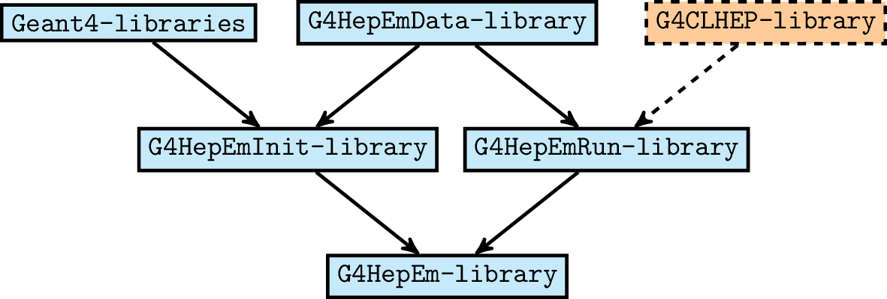

.. _introduction_doc:

Introduction
=============

The ``G4HepEm`` R&D project was initiated by the `Electromagnetic Physics Working Group`
of the ``Geant4`` collaboration as part of looking for solutions to reduce the computing 
performance bottleneck experienced by the `High Energy Physics` (HEP) detector 
simulation applications. 

Description and goals
-----------------------

The project (initially) targets the most performance critical part of the HEP detector 
simulation applications, i.e. the EM shower generation covering :math:`e^-/e^+` 
and :math:`\gamma` particle transport. By

  - starting from the EM physics modelling part, the project **isolates and extracts**
    **all the data and functionalities** required for EM shower simulation in HEP detectors 
    **in a clear, compact and well documented form**.
  
  - investigates the possible computing performance benefits of replacing the 
    **current general** particle transport simulation **stepping-loop** of ``Geant4`` 
    **by alternatives, highly specialised for particle types** and **tailored for HEP**
    detector simulation applications. 

  - by providing a clear, compact and well documented environment for EM shower 
    generation (already connected to ``Geant4`` applications), the project also 
    **provides an excellent domain for further** related **R&D activities**. 
    
  - especially, the **projects facilitates** R&D activities targeting **EM shower 
    simulation on GPU** by providing:
    
    - functionalities of making **all required physics data**
      **available on** the main **device memory**, together **with example kernels** 
      for their run-time usage.
      
    - isolated, **self-contained** (i.e. `"single function"`) **implementations of both the**
      physics related parts of the **stepping loop** and **all required physics interactions**

Physics modelling capability
-----------------------------
 
As mentioned above, the project initially targets the most performance critical 
part of the HEP detector simulation applications which is the EM shower generation. 
Therefore, the project covers :math:`e^-/e^+` and :math:`\gamma` particle 
transport simulation (i.e. those taking the highest fraction of the overall 
simulation steps in a general HEP detector simulation) with their EM interactions.

Since the targets are HEP detector simulation applications, these EM interactions 
are described by physics models used in this application area. This means, that 
``G4HepEm`` aims to provide EM modelling capability that is equivalent to the 
``Geant4`` EM-Standard Physics Option0 physics constructor` 
i.e. :math:`\texttt{G4EmStandardPhysics}`.

.. only:: html

   See more details in :numref:`table-physics`.

   .. table:: Summary of the physics interactions and models used in ``Geant4`` and ``G4HepEm`` (current state).
      :name:  table-physics
      :class: longtable
       
      +----------------+-----------------+---------------------------+------------------------------------+---------------------------------------------+--------------------------+
      | Particle       | Interactions    | Models                    |  Geant4 (EM-Opt0)                  |      G4HepEm                                | Energy Range             |
      +----------------+-----------------+---------------------------+------------------------------------+---------------------------------------------+--------------------------+
      |:math:`e^-`     | Ionisation      | Moller                    | ``G4MollerBhabhaModel``            | ``G4HepEmElectronInteractionIoni``          | 1 keV - 100 TeV          |
      |                +-----------------+---------------------------+------------------------------------+---------------------------------------------+--------------------------+
      |                | Bremsstrahlung  | Seltzer-Berger            | ``G4SeltzerBergerModel``           | ``G4HepEmElectronInteractionBrem``          | 1 keV -   1 GeV          |
      |                |                 +---------------------------+------------------------------------+---------------------------------------------+--------------------------+
      |                |                 | Rel. model [#]_           | ``G4eBremsstrahlungRelModel``      | ``G4HepEmElectronInteractionBrem``          | 1 GeV - 100 TeV          |
      |                +-----------------+---------------------------+------------------------------------+---------------------------------------------+--------------------------+
      |                | Coulomb scat.   | Urban/Goudsmit-Saunderson | ``G4UrbanMscModel``                |              under development ...          | 1 keV - 100 TeV          |
      +----------------+-----------------+---------------------------+------------------------------------+---------------------------------------------+--------------------------+
      |:math:`e^+`     | Ionisation      | Bhabha                    | ``G4MollerBhabhaModel``            | ``G4HepEmElectronInteractionIoni``          | 1 keV - 100 TeV          |
      |                +-----------------+---------------------------+------------------------------------+---------------------------------------------+--------------------------+
      |                | Bremsstrahlung  | Seltzer-Berger            | ``G4SeltzerBergerModel``           | ``G4HepEmElectronInteractionBrem``          | 1 keV -   1 GeV          |
      |                |                 +---------------------------+------------------------------------+---------------------------------------------+--------------------------+
      |                |                 | Rel. model                | ``G4eBremsstrahlungRelModel``      | ``G4HepEmElectronInteractionBrem``          | 1 GeV - 100 TeV          |
      |                +-----------------+---------------------------+------------------------------------+---------------------------------------------+--------------------------+
      |                | Coulomb scat.   | Urban/GS                  | ``G4UrbanMscModel``                |              under development ...          | 1 keV - 100 TeV          |
      |                +-----------------+---------------------------+------------------------------------+---------------------------------------------+--------------------------+
      |                | Annihilation    |:math:`e^+-e^- \to 2\gamma`| ``G4eplusAnnihilation``            | ``G4HepEmPositronInteractionAnnihilation``  |0 [#]_ - 100 TeV          |
      +----------------+-----------------+---------------------------+------------------------------------+---------------------------------------------+--------------------------+
      |:math:`\gamma`  | Photoelectric   | Livermore                 | ``G4LivermorePhotoElectricModel``  |              under development ...          |0 [#]_ - 100 TeV          |
      |                +-----------------+---------------------------+------------------------------------+---------------------------------------------+--------------------------+
      |                | Compton scat.   | Klein - Nishina [#]_      | ``G4KleinNishinaCompton``          |              under development ...          |100 eV - 100 TeV          |
      |                +-----------------+---------------------------+------------------------------------+---------------------------------------------+--------------------------+
      |                | Pair production | Bethe - Heitler [#]_      | ``G4PairProductionRelModel``       |             under development ...           |:math:`2m_0c^2` - 100 TeV |
      |                +-----------------+---------------------------+------------------------------------+---------------------------------------------+--------------------------+
      |                | Rayleigh scat.  | Livermore                 | ``G4LivermoreRayleighModel``       |              under development ...          | 100 keV - 100 TeV        |
      +----------------+-----------------+---------------------------+------------------------------------+---------------------------------------------+--------------------------+
      
      
            
   .. [#]  Bethe-Heitler DCS with screening(TF model) and Coulomb(Bethe-Maximon) 
      corrections to the first Born approximation; Wheeler-Lamb model for the 
      emission in the field of atomic electrons; Landau–Pomeranchuk–Migdal(LPM)
      effect is included.
   
   .. [#]  i.e. annihilation at rest.
    
   .. [#]  Strictly speaking, used at primary :math:`\gamma` energies above the 
      binding energy or the outermost :math:`e^-`, but the cross section is 
      kept to constant even at lower :math:`\gamma` energies in ``Geant4`` in order 
      to ensure that the low energy :math:`\gamma`-s are absorbed.
   
   .. [#]  Electron bounding is accounted on the top of the free electron approximation 
      of the Klein-Nishina model but only with a scattering function correction and 
      only in the integrated cross sections (i.e. bounding is accounted only in the 
      rate but not in the final state of the interaction description).
      
   .. [#]  Bethe-Heitler DCS with screening and Coulomb corrections; including 
      conversion in the field of atomic electrons; LMP correction (:math:`E_\gamma > 100` GeV).

.. only:: latex
      
   .. raw:: latex

      See more details in Table~\ref{tb::table-physics}.
 
      \begin{table}  %\begin{sidewaystable}%      
        \footnotesize
        \caption{Summary of the physics interactions and models used in ``Geant4`` and ``G4HepEm`` (current state).}\label{tb::table-physics}%          
        \vspace*{0.2cm}
        \begin{tabular} { |l | l | l | l | l | r |} 
          \hline
          \textbf{Particle}        &  \textbf{Interactions}           & \textbf{Models}           &  \textbf{\texttt{Geant4}} (EM-Opt0)            &      \textbf{\texttt{G4HepEm}} (with \texttt{G4HepEmE} prefix)                         & \textbf{Energy Range}      \\
          \hline
          \multirow{4}{*}{$e^-$}   &  Ionisation                      & Moller                    & \texttt{\scriptsize G4MollerBhabhaModel}       &   \texttt{\scriptsize ElectronInteractionIoni}   & 1 keV - 100 TeV  \\
                                   \cline{2-6}
                                   &  \multirow{2}{*}{Bremsstrahlung} & Seltzer-Berger            & \texttt{\scriptsize G4SeltzerBergerModel}      &   \texttt{\scriptsize ElectronInteractionBrem}   & 1 keV -   1 GeV          \\
                                                                      \cline{3-6}  
                                   &                                  & Rel. model\footnotemark    & \texttt{\scriptsize G4eBremsstrahlungRelModel} &   \texttt{\scriptsize ElectronInteractionBrem}  & 1 GeV - 100 TeV          \\                               
                                   \cline{2-6}
                                   &  Coulomb scat.                   & Urban/GS                  & \texttt{\scriptsize G4UrbanMscModel}           &    \scriptsize under development ...                         & 1 keV - 100 TeV          \\
          \hline                                   
          \multirow{5}{*}{$e^+$}   &  Ionisation                      & Bhabha                    & \texttt{\scriptsize G4MollerBhabhaModel}       &   \texttt{\scriptsize ElectronInteractionIoni}   & 1 keV - 100 TeV  \\
                                   \cline{2-6}
                                   &  \multirow{2}{*}{Bremsstrahlung} & Seltzer-Berger            & \texttt{\scriptsize G4SeltzerBergerModel}      &   \texttt{\scriptsize ElectronInteractionBrem}   & 1 keV -   1 GeV          \\
                                                                      \cline{3-6}  
                                   &                                  & Rel. model                & \texttt{\scriptsize G4eBremsstrahlungRelModel} &   \texttt{\scriptsize ElectronInteractionBrem}   & 1 GeV - 100 TeV          \\                               
                                   \cline{2-6}
                                   &  Coulomb scat.                   & Urban/GS                   & \texttt{\scriptsize G4UrbanMscModel}            &  \scriptsize under development ...                      & 1 keV - 100 TeV          \\
                                   \cline{2-6}
                                   &  Annihilation                    & $e^+-e^-\to 2\gamma$       & \texttt{\scriptsize G4eplusAnnihilation}        &  \texttt{\scriptsize PositronInteractionAnnihilation} & 0\footnotemark - 100 TeV \\  
       \hline                                   
       \multirow{4}{*}{$\gamma$}   &  Photoelectric                   & Livermore                  & \texttt{\scriptsize G4LivermorePhotoElectricModel} &  \scriptsize under development ...                        & 0\footnotemark - 100 TeV  \\
                                   \cline{2-6}
                                   &  Compton scat.                   & Klein - Nishina\footnotemark  & \texttt{\scriptsize G4KleinNishinaCompton}         &    \scriptsize under development ...              & 100 eV -   100 TeV        \\
                                   \cline{2-6}  
                                   &  Pair production                 & Bethe - Heitler\footnotemark    & \texttt{\scriptsize G4PairProductionRelModel}     &  \scriptsize under development ...                      & $2m_0c^2$ - 100 TeV          \\                               
                                   \cline{2-6}
                                   &  Rayleigh scat.                   & Livermore                  & \texttt{\scriptsize G4LivermoreRayleighModel}     &      \scriptsize under development ...             & 100 keV - 100 TeV          \\

        \hline
        \end{tabular}
      \end{table}  %%\end{sidewaystable}
      
      \addtocounter{footnote}{-4}
      \footnotetext[1]{Bethe-Heitler DCS with screening(TF model) and Coulomb(Bethe-Maximon) 
           corrections to the first Born approximation; Wheeler-Lamb model for the 
           emission in the field of atomic electrons; Landau–Pomeranchuk–Migdal(LPM)
           effect is included.} 
      \addtocounter{footnote}{1}
      \footnotetext{i.e. annihilation at rest.}
      \addtocounter{footnote}{1}
      \footnotetext{Strictly speaking, used at primary $\gamma$ energies above the 
         binding energy or the outermost $e^-$, but the cross section is 
         kept to constant even at lower $\gamma$ energies in \texttt{Geant4} in order 
         to ensure that the low energy $\gamma$-s are absorbed.}
      \addtocounter{footnote}{1}
      \footnotetext{Electron bounding is accounted on the top of the free electron approximation 
         of the Klein-Nishina model but only with a scattering function correction and 
         only in the integrated cross sections (i.e. bounding is accounted only in the 
         rate but not in the final state of the interaction description).}
      \addtocounter{footnote}{1}
      \footnotetext{Bethe-Heitler DCS with screening and Coulomb corrections; including 
         conversion in the field of atomic electrons; LMP correction ($E_\gamma > 100$ GeV).}

  
Library structure
-------------------

``G4HepEm`` extracts all the information, required for EM shower simulation,
from ``Geant4`` at its initialisation. Therefore, the **initialisation** part 
**heavily depends on** the functionalities provided by **the** ``Geant4`` **toolkit**. 
Contrary, ``G4HepEm`` utilises its own data structures and functionalities to provide 
all information required at **run-time** to perform simulation steps, which makes 
this part **independent from** ``Geant4`` [#]_ (and anything than other). 

``G4HepEm`` clearly **separates initialisation- and run-time functionalities**, 
by arranging these two, independent sets of functionalities into the **two independent**
``G4HepEmInit`` and ``G4HepEmRun`` **libraries**. 
This also provides the benefits of relying only on a small, compact library at 
run-time.

Since the data structures, required to perform the simulation steps at `run-time`, 
are filled at `initialisation time`, a third ``G4HepEmData`` **library**, `independent 
from anything`, contains **all** ``G4HepEm`` **data structure definitions**. Both the ``G4HepEmInit`` 
and ``G4HepEmRun`` libraries depend on this ``G4HepEmData`` library: the corresponding 
data structures are filled by using the initialisation time functionalities from ``G4HepEmInit`` and 
utilised for the simulation by using the run-time functionalities from ``G4HepEmRun``.  

The fourth ``G4HepEm`` **library**, depending on all the above three ``G4HepEmData``, 
``G4HepEmInit`` and ``G4HepEmRun`` **libraries**, 
is introduced to control and manage all the ``G4HepEm`` functionalities and to provide 
connection to any standard ``Geant4`` applications or (eventually) to the ``Geant4`` toolkit.

The ``G4HepEm`` library structure and dependencies are also illustrated in :numref:`Fig. %s <g4HepEm_libstruct>`

.. note:: This `separation of the initialisation- and run-time functionalities` 
   resulted in `separation of data and functionalities`. Therefore, the ``G4HepEm`` 
   code base very often more `C-style` than the object oriented `C++` i.e. `data structures` 
   and `functions` operating on the structures are decoupled unlike the `C++` object oriented
   encapsulation of data and functionalities.
   On the same time, this clear separation of the data structures and initialisation- v.s. run-time 
   functionalities facilitates porting all ``G4HepEm`` features to alternative hardwares like GPU. 

   The ``G4HepEm`` library component structure with their dependencies.

.. [#] At the moment, there is a run-time dependence on ``G4CLHEP`` through the random number generation.

.. _ref-Connection-to-Geant4:

Connection to Geant4
---------------------

The ultimate goal of ``G4HepEm`` is to provide alternatives to the current single, general simulation stepping 
loop, that are specialised for :math:`e^-/e^+` and :math:`\gamma` particles. This will eventually allow to exploit 
all the benefits given by the compact ``G4HepEm`` implementation, especially when performing complete :math:`e^-/e^+` or 
:math:`\gamma` transport simulation steps relying solely on ``G4HepEm`` functionalities (i.e. skipping transportation whenever possible). 

However, the above requires some modifications in the related part of the ``Geant4`` toolkit. Therefore, during the 
development of the required functionalities, the ``Geant4`` ``G4VProcess`` interface is used to connect ``G4HepEm`` 
to (any) ``Geant4`` applications. This choice also facilitates the validation of the (already)
developed ``G4HepEm`` data structures and functionalities against the corresponding, native ``Geant4`` versions through 
a simple switch in the physics list of the ``Geant4`` application used for the validation.

The ``Geant4`` ``G4VProcess`` interface is implemented in the :cpp:class:`G4HepEmProcess` class. See its documentation for more details.  

How it works 
--------------

``G4HepEm`` extracts all the information that is needed for the EM shower simulation from ``Geant4`` at initialisation time.
These include some global data structures related to the materials, material-cuts couples used in the detector of the application 
as well as some configuration parameters. Integrated cross section related quantities
are also generated for the individual particle types and their interactions (e.g. restricted macroscopic cross section, stopping power, range, etc. data for :math:`e^-/e^+`) 
in the form of tables by using the corresponding native ``Geant4`` models. See more on these data structures at the :ref:`Global Data Structures Section <ref-Global-data-structures>`.

These initialisations are done by a `master` :cpp:class:`G4HepEmRunManager` that is responsible for creating and populating the corresponding data 
structures. Since these data are read-only during the simulation they are shared by all `worker` G4HepEmRunManager-s. Each of 
such `worker` :cpp:class:`G4HepEmRunManager` has their own instance of the :cpp:class:`G4HepEmTLData` that stores all the worker-local data 
such as the random number generator engine or particle track buffers. They also have their own :cpp:class:`G4HepEmElectronManager` and :cpp:class:`G4HepEmGammaManager` objects. 
These managers per particle types can provide all the physics related information that are needed during the simulation i.e. how far the 
particles go according to their physics and what are the results of their physics interactions. These answers can be received form the managers 
through two simple function calls. It must be noted, that these top level manager per particle type do not have any field variables or in other words, they do 
not store any states. All the information (e.g. input/output track state) are received/delivered by the two methods of these physics related managers encapsulated 
into their :cpp:class:`G4HepEmTLData` input parameter. Therefore, a single :cpp:class:`G4HepEmElectronManager` or :cpp:class:`G4HepEmGammaManager` could be utilised by any number of 
workers simultaneously as long as these workers possess their own :cpp:class:`G4HepEmTLData` for the information flow. 
See more on this at the :ref:`Particle Managers Section <ref-Particle-managers>`.

In the current way of connecting ``G4HepEm`` to ``Geant4`` applications (see above at :ref:`Connection to Geant4<ref-Connection-to-Geant4>`),
each of the :cpp:class:`G4HepEmProcess` object has their own :cpp:class:`G4HepEmRunManager` member. When the ``Geant4`` master invokes the physics initialisation, 
the :cpp:class:`G4HepEmRunManager` of the corresponding :cpp:class:`G4HepEmProcess`, i.e. the master :cpp:class:`G4HepEmRunManager` is initialised. This includes 
all the above-mentioned global data structure constructions and initialisations. 
Then when ``Geant4`` workers are initialised, the :cpp:class:`G4HepEmRunManager`-s of the corresponding :cpp:class:`G4HepEmProcess`-s, i.e. the worker :cpp:class:`G4HepEmRunManager`-s 
are initialised. This includes of setting their shared, global data member pointers and construction of their local :cpp:class:`G4HepEmTLData` or particle manager members. 
Then at run-time, these :cpp:class:`G4HepEmRunManager`-s, especially their :cpp:class:`G4HepEmElectronManager` or :cpp:class:`G4HepEmGammaManager` are utilised to provide 
all the physics related information for the native ``Geant4`` tracking (in the ``AlongStepGetPhysicalInteractionLength`` and ``AlongStepDoIt``
interface methods of the ``G4VProcess`` interface of ``Geant4``). In both cases, the local :cpp:class:`G4HepEmTLData` members of the :cpp:class:`G4HepEmRunManager` objects 
of the :cpp:class:`G4HepEmProcess` are utilised to propagate information between ``Geant4`` and ``G4HepEm``.
 

GPU support
------------

Current state
--------------

Example applications
----------------------

